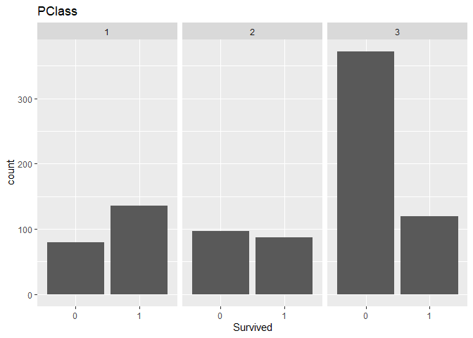
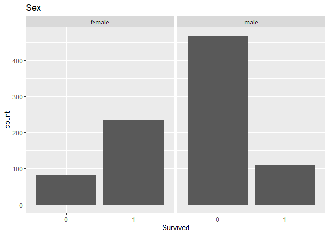
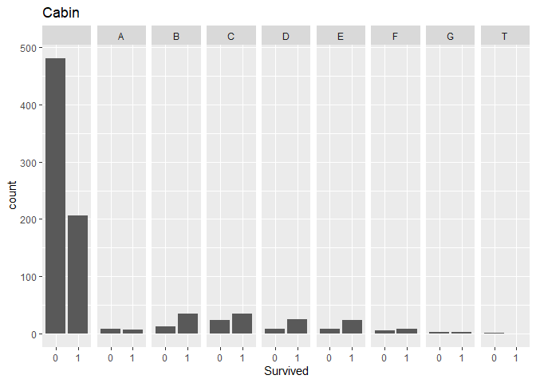
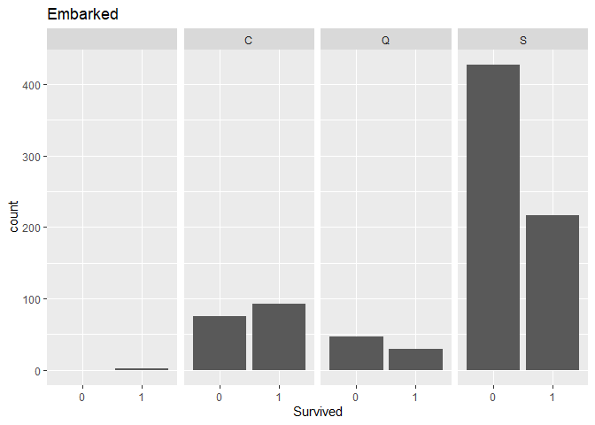
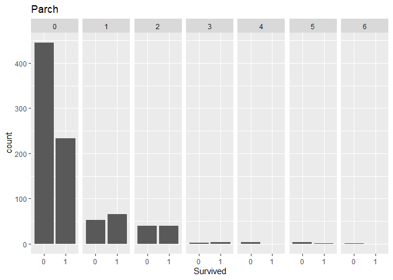
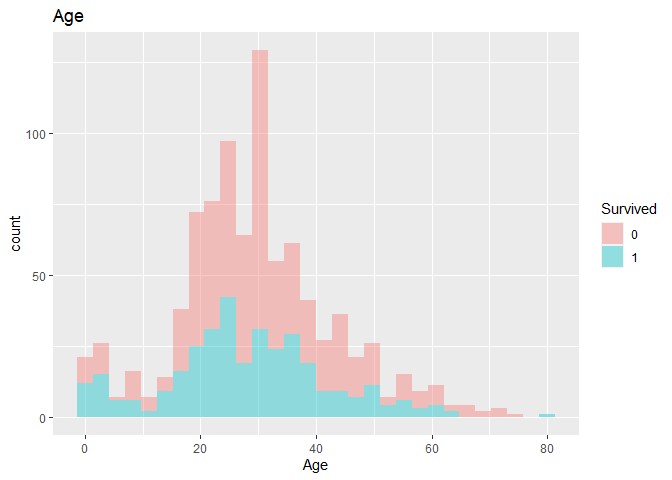
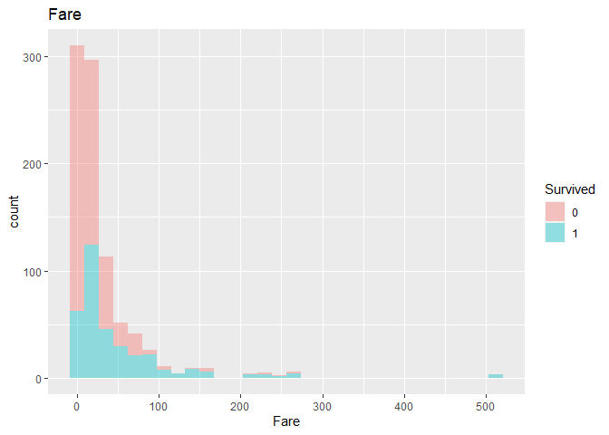
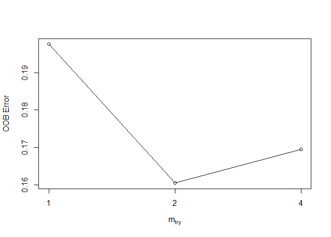

binary classification
================
Satoru
2022-06-22

## Titanic Analysis

This is a basic but convenient machine learning method when it comes to
binary classification problems. Here, I use titanic data from
[Kaggle](https://www.kaggle.com/competitions/titanic/data)

### Preprocessing

``` r
d <- read.csv("./input/train.csv")
head(d)
```

    ##   PassengerId Survived Pclass
    ## 1           1        0      3
    ## 2           2        1      1
    ## 3           3        1      3
    ## 4           4        1      1
    ## 5           5        0      3
    ## 6           6        0      3
    ##                                                  Name    Sex Age SibSp Parch
    ## 1                             Braund, Mr. Owen Harris   male  22     1     0
    ## 2 Cumings, Mrs. John Bradley (Florence Briggs Thayer) female  38     1     0
    ## 3                              Heikkinen, Miss. Laina female  26     0     0
    ## 4        Futrelle, Mrs. Jacques Heath (Lily May Peel) female  35     1     0
    ## 5                            Allen, Mr. William Henry   male  35     0     0
    ## 6                                    Moran, Mr. James   male  NA     0     0
    ##             Ticket    Fare Cabin Embarked
    ## 1        A/5 21171  7.2500              S
    ## 2         PC 17599 71.2833   C85        C
    ## 3 STON/O2. 3101282  7.9250              S
    ## 4           113803 53.1000  C123        S
    ## 5           373450  8.0500              S
    ## 6           330877  8.4583              Q

Our objective is to learn this data and create a model to predict target
variable “Survived”. For a quick analysis, let me exclude Name, Ticket
as well as PassengerID which is meaningless. Cabin looks useful so let’s
take the Capitals.

Then, take a look at Age.

``` r
map_dbl(d, ~sum(is.na(.)))
```

    ## PassengerId    Survived      Pclass        Name         Sex         Age 
    ##           0           0           0           0           0         177 
    ##       SibSp       Parch      Ticket        Fare       Cabin    Embarked 
    ##           0           0           0           0           0           0

we have 177 of age missing. Want to fill them anyhow.

I use regression to fill missing Ages and process Cabin column.

``` r
d_lm <- d[,-c(1,4,9)] %>% mutate(Cabin = str_sub(Cabin,1,1))
mr <- lm(Age~.,data = d_lm)
pred <- predict(mr, d_lm)
d_train <- d_lm %>% mutate(Cabin = str_sub(Cabin,1,1),pred=ifelse(pred<0,0,pred)) %>% 
  mutate(Age = ifelse(is.na(Age==T),pred,Age)) %>% mutate(Age=ifelse(Age<0,0,Age),Survived=factor(Survived,levels=c(0,1))) %>% dplyr::select(-pred)
head(d_train)
```

    ##   Survived Pclass    Sex      Age SibSp Parch    Fare Cabin Embarked
    ## 1        0      3   male 22.00000     1     0  7.2500              S
    ## 2        1      1 female 38.00000     1     0 71.2833     C        C
    ## 3        1      3 female 26.00000     0     0  7.9250              S
    ## 4        1      1 female 35.00000     1     0 53.1000     C        S
    ## 5        0      3   male 35.00000     0     0  8.0500              S
    ## 6        0      3   male 31.68989     0     0  8.4583              Q

For the test data, apply the same treatment.

``` r
d_lm2 <- read.csv("./input/test.csv")
d_lm2 <- d_lm2[,-c(1,3,8)] %>% mutate(Cabin = str_sub(Cabin,1,1))

mr2 <- lm(Age~.,data = d_lm2)
pred <- predict(mr2, d_lm2)

d_test <- d_lm2 %>% mutate(Cabin = str_sub(Cabin,1,1),pred=ifelse(pred<0,0,pred)) %>% 
  mutate(Age = ifelse(is.na(Age==T),pred,Age)) %>% mutate(Age=ifelse(Age<0,0,Age)) %>% dplyr::select(-pred)

head(d_test)
```

    ##   Pclass    Sex  Age SibSp Parch    Fare Cabin Embarked
    ## 1      3   male 34.5     0     0  7.8292              Q
    ## 2      3 female 47.0     1     0  7.0000              S
    ## 3      2   male 62.0     0     0  9.6875              Q
    ## 4      3   male 27.0     0     0  8.6625              S
    ## 5      3 female 22.0     1     1 12.2875              S
    ## 6      3   male 14.0     0     0  9.2250              S

Now, ready to analyze!

### Explanatory Data Analysis

Before prediction, take a look at distributions of each variable on
target variable.

``` r
(g_class <- d_train %>% ggplot() + geom_bar(aes(Survived)) + facet_grid(.~Pclass) + labs(title="PClass"))
```

<!-- -->

``` r
(g_sex <- d_train %>% ggplot() + geom_bar(aes(Survived)) + facet_grid(.~Sex) + labs(title="Sex"))
```

<!-- -->

``` r
(g_cabin <- d_train %>% ggplot() + geom_bar(aes(Survived)) + facet_grid(.~Cabin) + labs(title="Cabin"))
```

<!-- -->

``` r
(g_embark <- d_train %>% ggplot() + geom_bar(aes(Survived)) + facet_grid(.~Embarked) + labs(title="Embarked"))
```

<!-- -->

``` r
(g_parch <- d_train %>% ggplot() + geom_bar(aes(Survived)) + facet_grid(.~Parch) + labs(title="Parch"))
```

<!-- -->

``` r
(g_age <- d_train %>% ggplot(aes(x=Age,fill=Survived)) + geom_histogram(alpha=.4) + labs(title="Age"))
```

<!-- -->

``` r
(g_fare <- d_train %>% ggplot(aes(x=Fare,fill=Survived)) + geom_histogram(alpha=.4) + labs(title="Fare"))
```

<!-- -->
\### Logistic regression

By AIC, detect the best model.

``` r
fit <- glm(Survived~., data=d_train, family = binomial)
# search the most fitted combination of variables by AIC
aic <- stepAIC(fit)
```

    ## Start:  AIC=786.55
    ## Survived ~ Pclass + Sex + Age + SibSp + Parch + Fare + Cabin + 
    ##     Embarked
    ## 
    ##            Df Deviance     AIC
    ## - Embarked  3   753.83  783.83
    ## - Parch     1   751.12  785.12
    ## - Fare      1   751.22  785.22
    ## - Cabin     8   766.33  786.33
    ## <none>          750.55  786.55
    ## - SibSp     1   769.42  803.42
    ## - Pclass    1   782.79  816.79
    ## - Age       1   796.46  830.46
    ## - Sex       1   969.54 1003.54
    ## 
    ## Step:  AIC=783.83
    ## Survived ~ Pclass + Sex + Age + SibSp + Parch + Fare + Cabin
    ## 
    ##          Df Deviance     AIC
    ## - Parch   1   754.62  782.62
    ## - Fare    1   754.98  782.98
    ## - Cabin   8   769.80  783.80
    ## <none>        753.83  783.83
    ## - SibSp   1   775.10  803.10
    ## - Pclass  1   786.08  814.08
    ## - Age     1   801.42  829.42
    ## - Sex     1   986.97 1014.97
    ## 
    ## Step:  AIC=782.62
    ## Survived ~ Pclass + Sex + Age + SibSp + Fare + Cabin
    ## 
    ##          Df Deviance     AIC
    ## - Fare    1   755.47  781.47
    ## - Cabin   8   770.59  782.59
    ## <none>        754.62  782.62
    ## - SibSp   1   780.83  806.83
    ## - Pclass  1   788.23  814.23
    ## - Age     1   802.19  828.19
    ## - Sex     1   990.49 1016.49
    ## 
    ## Step:  AIC=781.47
    ## Survived ~ Pclass + Sex + Age + SibSp + Cabin
    ## 
    ##          Df Deviance     AIC
    ## - Cabin   8   771.33  781.33
    ## <none>        755.47  781.47
    ## - SibSp   1   780.83  804.83
    ## - Pclass  1   796.30  820.30
    ## - Age     1   804.25  828.25
    ## - Sex     1   995.42 1019.42
    ## 
    ## Step:  AIC=781.33
    ## Survived ~ Pclass + Sex + Age + SibSp
    ## 
    ##          Df Deviance     AIC
    ## <none>        771.33  781.33
    ## - SibSp   1   796.07  804.07
    ## - Age     1   819.32  827.32
    ## - Pclass  1   900.25  908.25
    ## - Sex     1  1015.45 1023.45

``` r
print(aic)
```

    ## 
    ## Call:  glm(formula = Survived ~ Pclass + Sex + Age + SibSp, family = binomial, 
    ##     data = d_train)
    ## 
    ## Coefficients:
    ## (Intercept)       Pclass      Sexmale          Age        SibSp  
    ##     6.06120     -1.34527     -2.73780     -0.05454     -0.46442  
    ## 
    ## Degrees of Freedom: 890 Total (i.e. Null);  886 Residual
    ## Null Deviance:       1187 
    ## Residual Deviance: 771.3     AIC: 781.3

Apply the lowest AIC fomula to logistic regression.

``` r
formula <- aic$formula
fit.2 <- glm(formula = formula,data=d_train, family = binomial)
summary(fit.2)
```

    ## 
    ## Call:
    ## glm(formula = formula, family = binomial, data = d_train)
    ## 
    ## Deviance Residuals: 
    ##     Min       1Q   Median       3Q      Max  
    ## -2.8838  -0.5956  -0.3946   0.6097   2.5329  
    ## 
    ## Coefficients:
    ##              Estimate Std. Error z value Pr(>|z|)    
    ## (Intercept)  6.061201   0.534841  11.333  < 2e-16 ***
    ## Pclass      -1.345265   0.130508 -10.308  < 2e-16 ***
    ## Sexmale     -2.737799   0.197509 -13.862  < 2e-16 ***
    ## Age         -0.054535   0.008373  -6.514 7.34e-11 ***
    ## SibSp       -0.464423   0.104315  -4.452 8.50e-06 ***
    ## ---
    ## Signif. codes:  0 '***' 0.001 '**' 0.01 '*' 0.05 '.' 0.1 ' ' 1
    ## 
    ## (Dispersion parameter for binomial family taken to be 1)
    ## 
    ##     Null deviance: 1186.66  on 890  degrees of freedom
    ## Residual deviance:  771.33  on 886  degrees of freedom
    ## AIC: 781.33
    ## 
    ## Number of Fisher Scoring iterations: 5

odds should be calculated as the fomula below

odds = exp(6.06120081 - 1.34526511*Pclass - 2.73779904*Sexmale -
0.05453505*Age - 0.46442316*SibSp)

``` r
pred.test <- predict(fit.2,d_test)
logit.test <- 1/(1+exp(-pred.test))
result.test <- ifelse(logit.test<0.5,0,1) 
```

0.5 is set as the border of survival, which can be changed

### Randomforest

``` r
#tuning
set.seed(1234)
tune <- tuneRF(d_train[,-1],d_train[,1],plot = T)
```

    ## mtry = 2  OOB error = 16.05% 
    ## Searching left ...
    ## mtry = 1     OOB error = 19.75% 
    ## -0.2307692 0.05 
    ## Searching right ...
    ## mtry = 4     OOB error = 16.95% 
    ## -0.05594406 0.05

<!-- -->

Use the mtry which minimizes error

``` r
rf <- randomForest(Survived~.,data=d_train, type="classification", mtry = tune[which.min(tune[, 2]), 1])

res <- predict(rf, d_test)
res_bi <- ifelse(res<=0.5,0,1)
```
